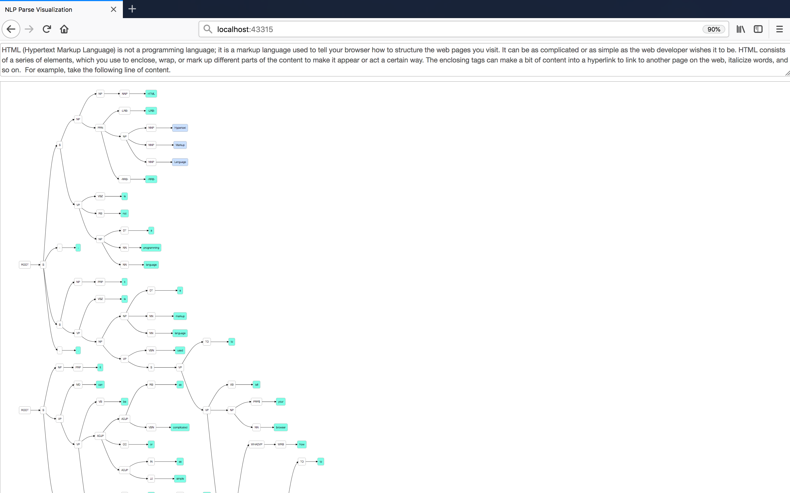

# nlpviz

Nlpviz visualizes the structure of English sentences using Stanford CoreNLP and D3.js.

　　

This repository is a fork of [bpodgursky/nlpviz](https://github.com/bpodgursky/nlpviz).

I made this repository for my private use on my MacBook.

## Requirement

[Java SE Development Kit 8](http://www.oracle.com/technetwork/java/javase/downloads/jdk8-downloads-2133151.html)

[Apache Maven](https://maven.apache.org)

[Node.js](https://nodejs.org/en/) (v8.9.3)

## Platform

macOS High Sierra 10.13

## Installtion

```shell
$ npm install
```

The first time you run this, it will take some time and network bandwidth to install the dependencies - the Stanford NLP core model jar is on its own over 200 MB.

## Starting the App

```
$ npm run start
```

At this point, you can open [http://localhost:43315](http://localhost:43315) in your browser.
